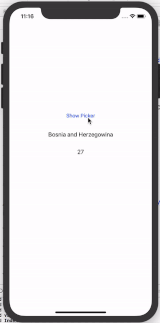

# ARPicker

[](https://travis-ci.org/ar.warraich@outlook.com/ARPicker)
[](https://cocoapods.org/pods/ARPicker)
[](https://cocoapods.org/pods/ARPicker)
[](https://cocoapods.org/pods/ARPicker)



## Requirements

- iOS 9.0
- Xcode 11.2
- Swift 5

## Installation

ARPicker is available through [CocoaPods](https://cocoapods.org). To install
it, simply add the following line to your Podfile:

```ruby
pod 'ARPicker'
```
Then, run the following command:

```ruby
pod install
```
## Usage 

### Import

```swift
import ARPicker
```
### Initialization
Then Go to your viewController and to show picker as following:   

```swift
let countryList :[String] = ["Afghanistan", "Albania", "Algeria", "American Samoa", "Andorra", "Angola", "Anguilla", "Antarctica", "Antigua and Barbuda", "Argentina", "Armenia", "Aruba"]

self.showPickerView(options: countryList, selectedOption: "Andorra", doneTitleText: "Done",cancelTitleText: "Cancel",didSelectDate: { (selectedValue, selectedIndex) in

print("Selected value: \(selectedValue)")
print("Selected Index: \(selectedIndex)")

self.selectedValueLabel.text = selectedValue
self.selectedIndexLabel.text = "\(selectedIndex + 1)"
})
```
Explanation of different parameters
1. set value of `selectedOption` to highlight the option at start.
2. set value of `doneTitleText` to change done button title.
3. set value of `cancelTitleText` to change cancel button title.
4. set completion block  `didSelectDate`, called when `Done` button is touched.


## Author

AbdulRehman  Warraich, ar.warraich@outlook.com

## License

ARPicker is released under the MIT license. [See LICENSE](https://github.com/AbdulRehmanWarraich/ARPicker/blob/master/LICENSE) for details.
